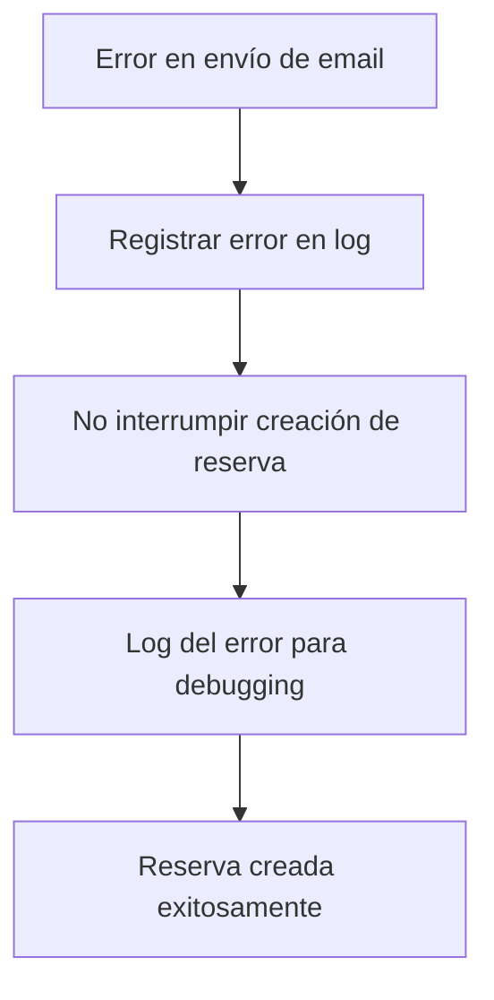

# Sistema de Emails Automáticos - O11CE

## Descripción General

El sistema O11CE incluye un sistema de envío automático de emails que se activa cuando los clientes realizan reservas. Este sistema está diseñado para proporcionar confirmaciones inmediatas y mejorar la experiencia del cliente.

## Funcionalidades Implementadas

### 1. Envío Automático de Emails de Confirmación

**Cuándo se activa:**
- Automáticamente cuando se crea una nueva reserva con estado `confirmed`
- Solo para reservas nuevas (no para actualizaciones)

**Qué incluye el email:**
- Confirmación de la reserva
- Detalles de la habitación
- Fechas de check-in y check-out
- Número de reserva
- Información de contacto

### 2. Logs de Email

**Registro automático:**
- Todos los emails enviados se registran en la base de datos
- Se guarda información del destinatario, asunto, contenido y estado
- Permite seguimiento y debugging de emails

**Estados posibles:**
- `pending`: Email en cola
- `sent`: Email enviado exitosamente
- `failed`: Email falló al enviar

### 3. Manejo de Errores

**Características:**
- Los errores de email no impiden la creación de reservas
- Se registran logs detallados de errores
- Sistema de fallback para evitar interrupciones

## Arquitectura del Sistema

### Modelos Involucrados

1. **Booking** (`app/bookings/models.py`)
   - Método `save()` modificado para enviar emails automáticamente
   - Solo envía emails para nuevas reservas confirmadas

2. **Client** (`app/clients/models.py`)
   - Proporciona información del destinatario (email, nombre)
   - Validación de email requerida

3. **EmailLog** (`app/core/models.py`)
   - Registra todos los intentos de envío de email
   - Permite seguimiento y auditoría

### Servicios

**EmailService** (`app/core/services.py`)
- `send_booking_confirmation()`: Envía email de confirmación
- `send_booking_confirmation_async()`: Versión asíncrona para uso en modelos
- `send_welcome_email()`: Email de bienvenida para nuevos clientes

### APIs Disponibles

1. **Crear Reserva con Email** (`POST /api/reservas/crear-con-cliente/`)
   - Crea reserva y envía email automáticamente
   - Retorna información sobre el envío del email

2. **Reenviar Email** (`POST /api/reservas/{id}/reenviar-email/`)
   - Permite reenviar emails de confirmación manualmente
   - Útil para casos donde el email automático falló

## Configuración Requerida

### Configuración de Email en Django

En `config/settings.py`:

```python
# Configuración de email
EMAIL_BACKEND = 'django.core.mail.backends.smtp.EmailBackend'
EMAIL_HOST = 'smtp.gmail.com'  # O tu servidor SMTP
EMAIL_PORT = 587
EMAIL_USE_TLS = True
EMAIL_HOST_USER = 'tu-email@gmail.com'
EMAIL_HOST_PASSWORD = 'tu-contraseña-de-aplicación'
DEFAULT_FROM_EMAIL = 'O11CE <tu-email@gmail.com>'
```

### Configuración para Desarrollo

Para desarrollo, puedes usar el backend de consola:

```python
EMAIL_BACKEND = 'django.core.mail.backends.console.EmailBackend'
```

## Comandos de Prueba

### 1. Probar Email de Confirmación

```bash
python manage.py test_email --type booking --id <booking_id>
```

### 2. Probar Email de Bienvenida

```bash
python manage.py test_email --type welcome --id <client_id>
```

### 3. Probar Envío Automático

```bash
# Crear datos de prueba
python manage.py test_auto_email --create-test-data

# Probar envío automático
python manage.py test_auto_email --client-id <client_id> --room-id <room_id>
```

## Flujo de Trabajo

### 1. Creación de Reserva

```mermaid
graph TD
    A[Cliente crea reserva] --> B[API valida datos]
    B --> C[Crear/actualizar cliente]
    C --> D[Crear reserva]
    D --> E[Método save() del modelo]
    E --> F{¿Es nueva reserva confirmada?}
    F -->|Sí| G[Enviar email automáticamente]
    F -->|No| H[Finalizar]
    G --> I[Crear log de email]
    I --> J[Enviar email]
    J --> K[Actualizar estado del log]
    K --> H
```

### 2. Manejo de Errores



## Monitoreo y Debugging

### 1. Verificar Logs de Email

```python
from app.core.models import EmailLog

# Ver todos los emails enviados
emails = EmailLog.objects.all().order_by('-created_at')

# Ver emails fallidos
failed_emails = EmailLog.objects.filter(status='failed')

# Ver emails de una reserva específica
booking_emails = EmailLog.objects.filter(booking_id=123)
```

### 2. Verificar Configuración

```python
from django.conf import settings

# Verificar configuración de email
print(settings.EMAIL_BACKEND)
print(settings.EMAIL_HOST)
print(settings.DEFAULT_FROM_EMAIL)
```

## Mejores Prácticas

### 1. Configuración de Producción

- Usar servicios de email confiables (SendGrid, Mailgun, etc.)
- Configurar SPF, DKIM y DMARC
- Monitorear tasas de entrega
- Implementar colas de email para alta concurrencia

### 2. Testing

- Probar con emails reales antes de producción
- Verificar plantillas en diferentes clientes de email
- Monitorear logs de errores regularmente

### 3. Mantenimiento

- Revisar logs de email fallidos regularmente
- Actualizar plantillas según feedback de clientes
- Monitorear métricas de entrega

## Troubleshooting

### Problemas Comunes

1. **Emails no se envían**
   - Verificar configuración SMTP
   - Revisar logs de Django
   - Verificar que el cliente tenga email válido

2. **Emails van a spam**
   - Configurar registros SPF/DKIM
   - Usar dominio propio para envío
   - Evitar palabras que activen filtros de spam

3. **Errores de autenticación SMTP**
   - Verificar credenciales
   - Usar contraseñas de aplicación para Gmail
   - Verificar configuración de seguridad del servidor

### Comandos de Debugging

```bash
# Ver logs de Django
python manage.py runserver --verbosity=2

# Probar configuración de email
python manage.py shell
>>> from django.core.mail import send_mail
>>> send_mail('Test', 'Test message', 'from@example.com', ['to@example.com'])
```

## Próximas Mejoras

1. **Sistema de Colas**
   - Implementar Celery para envío asíncrono
   - Mejorar rendimiento para alta concurrencia

2. **Plantillas Dinámicas**
   - Sistema de plantillas más flexible
   - Personalización por tipo de cliente

3. **Notificaciones Push**
   - Integración con notificaciones push
   - SMS como alternativa

4. **Analytics**
   - Métricas de apertura y clics
   - A/B testing de plantillas 